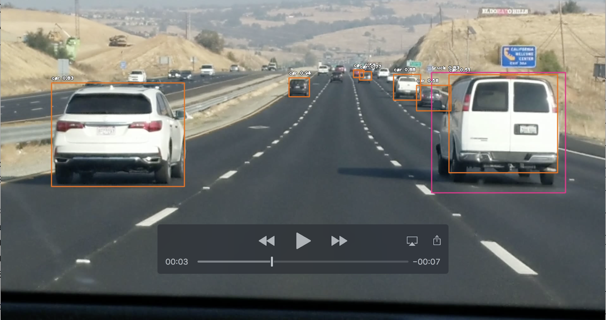

# VideoObjectDetection
Allows users to detect objects in videos using ImageAI libraries.

## Overview
The objective of the program is to analyze video frames and draw boxes around  objects detected. 
Here, I am taking a video which might have cars, trucks, humans, bike etc. and draw boxes around them with percentage of accuracy and generates the new annotated video.


## Code Links
I have used ImageAI library and the documentation below to use the model :

```
https://heartbeat.fritz.ai/detecting-objects-in-videos-and-camera-feeds-using-keras-opencv-and-imageai-c869fe1ebcdb
```

I used the following colab for running my model :
```
VideoObjectDetection.ipynb
```


Please note that you need to have the video that you want to predict stored in Google Drive and update the ‘path’  variable to the google drive path where video is located.


## Data Set Links
Used the following video for predicting cars

```
https://drive.google.com/open?id=1hsz7X_mm3SmaHyGWLz1RTv8CR8ulNIcD
```

## Details
The code above uses the ImageAI  library to use pre trained models for image and video detection.
This library comes with 4 classes, namely :
* Prediction Classes
* Detection Classes
* Video and Live-Feed Detection and Analysis
* Custom Training and Prediction Classes

In this particular project, I have used Detection class. In this class, there are 3 trained models namely :
* RetinaNet
* YOLOv3
* TinyYOLOv3

This ObjectDetection class comes with functions that are used from the above models to detect an Image(where it will detect the object) or sets of Image(array, where it will detect the object and enclose them in a box).
These pretrained models have used COCO dataset for the training. 
```
Link to COCO dataset : http://cocodataset.org/#home
```
I have used setModelTypeAsYOLOv3() function to use YOLO( You Only Look Once) for my project, which is a fully convolutional network having 75 layers.
After loading the model, the application uses detectObjectsFromVideo() to detect objects from video by taking 29 frames per second (which is configurable).
Finally creating an .avi file with objects detected in the video.

Here is a sample screenshot from the Video



